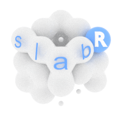

<!-- README.md is generated from README.Rmd. Please edit that file -->

# slabR <a href='https://jack-h-laverick.github.io/slabR'></a>

<!-- badges: start -->

[](https://www.tidyverse.org/lifecycle/#experimental)
[](https://github.com/Jack-H-Laverick/nemomedusR/actions)
[](https://codecov.io/gh/Jack-H-Laverick/nemomedusR?branch=master)
[](https://www.codefactor.io/repository/github/Jack-H-Laverick/nemomedusR)
[](https://github.com/Jack-H-Laverick/nemomedusR/commits/master)
<!-- badges: end -->

slabR is an R package for creating summary slabs from arrays according
to a summary scheme `slab(array, scheme)`. This is useful for ecosystem
models which use a single value to represent volumes within a 3D grid.
The different summaries are implemented in C++ using Rcpp for speed.

## Motivation

slabR was built to summarise 3D ocean model output. Often the volumes of
interest remain constant, but different arrays exist for time steps and
variables.

  - If you want to summarise the same area for multiple layers of an
    array the `exactextractr` package is a fantastic tool. However, with
    increasing depth the sea floor starts to encroach on the area,
    meaning fewer pixels are water. This also requires the projection of
    your data to be interpretable by the `raster` package, and a
    secondary step is neccessary to summarise across layers.

  - You could summarise across all depths before averaging spatially
    with optimised functions like `colmeans`, but this wastes time
    handling points outside of your target volume which need to be
    removed later.

  - Indexing the array directly from R to only handle useful values can
    be slow when working with many files over large (global) volumes.

slabR performs common summary operations on an array by indexing and
group membership. We refer to the combination of indices and groupings
as a summary scheme when represented as a dataframe. By using a summary
scheme, multiple volumes can be summarised from an array, only visiting
the pixels of interest, and without leaving the Rcpp loop. slabR plays
nicely with pipes, using the array to be processed as the first
argument. This allows a constant summary scheme to by applied with
`map(list(arrays), slab, scheme)`.

## Installation

The development version can be downloaded from
[GitHub](https://github.com/) with:

``` r
remotes::install_github("Jack-H-Laverick/slabR")
```

## Project Documentation

Head to [GitHub.io](https://jack-h-laverick.github.io/slabR/index.html)
to view the full documentation.

<br/>

The navbar contains links to an index of documented functions and a
change log.
